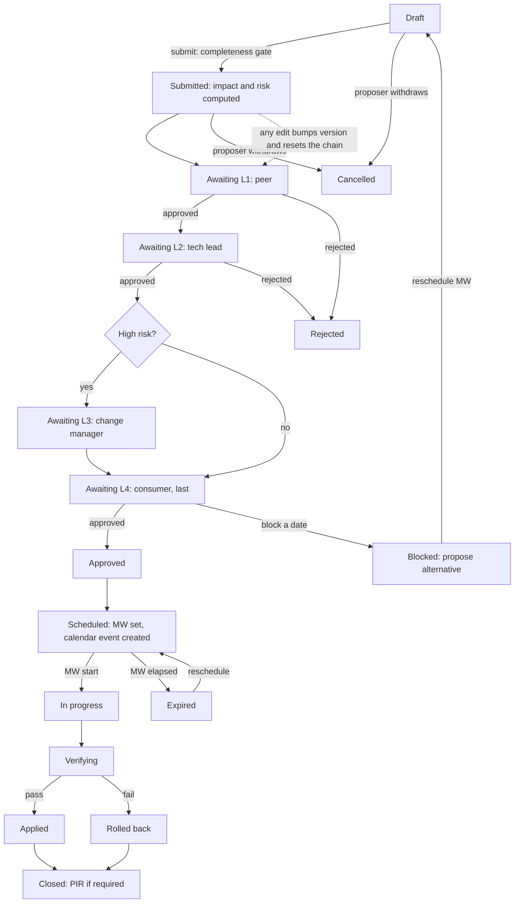

# IS-CMDB Change Advisory Board (CAB) Process Specification

Change management for IS infrastructure, built on the IS-CMDB.

Status: Proposal, open for review
Type: Process
Author: Fer (git: fercc17), IS SRE. [HUMAN INPUT REQUIRED: confirm name and role]
Scope: IS SRE change management across all clouds and the three regions (AMER, EMEA, APAC), covering the managed-by teams that perform changes and the consumed-by teams that absorb them.
Date: June 2026
Depends on: IS-CMDB (configuration management database). Canonical Identity Platform (IDP) for identity and groups.
Parent of: none
Closes: [HUMAN INPUT REQUIRED: CultureAmp action, ticket, or commitment, if any]

This specification documents a proposed process, not a running system. The CAB layer described here is not yet implemented. It is built on IS-CMDB primitives that do exist today (maintenance windows, the dependency graph, ownership and placement data, the notification channels); those are cited with source references in Further Information. The new CAB process, identity model, and integrations are proposals and are called out as such.

---

## Abstract

A change management process built on IS-CMDB that gives the SRE team situational awareness of every infrastructure change before it happens: who runs it, what it affects, and who must be told. It computes blast radius and stakeholders from the CMDB topology, routes each change through a risk based approval chain, and notifies affected consuming teams with a message tuned to whether their service is resilient. The system records and coordinates changes; it does not execute them.

---

## Rationale

IS runs a large estate (on the order of two thousand environments across multiple clouds and three regions) and that estate is reconciled and operated continuously. Change coordination on top of it is still done by hand and by tribal knowledge. When an SRE takes down a node, a switch, or a cloud, the questions that decide whether the change is safe are answered from memory: what runs there, what depends on it, who consumes it, whether those services survive the loss. Operating that way at scale produces no situational awareness, inconsistent stakeholder communication, and no durable audit trail of who approved what and why.

Manual impact analysis does not scale with the estate. The data needed to answer the safety questions already lives in the CMDB: live placement, the declared dependency graph, the managed-by and consumed-by ownership model, criticality, and a resilience signal. That data is the leverage this process spends. The same team can assess the blast radius of a change and notify the right stakeholders automatically, rather than re-deriving it by hand for every change.

The process exists to elevate the maturity of how IS reviews and communicates change. It makes the implicit explicit: every change carries a maintenance window, a named executer, the command to run, the command to verify it worked, and the command to roll back. It routes the change to the right approvers based on computed risk, and it tells consuming teams what will happen to their service in terms of resiliency, so a brief auto-recovering blip is never confused with an outage that needs a human on the other side. The result is change executed at scale with the situational awareness, the approval rigour, and the audit trail that the current manual process cannot provide.

A backfilled rationale would normally stop here. This is a forward proposal, so the motivation above is the design argument, not invented history. [HUMAN INPUT REQUIRED: any specific motivating incident, audit finding, or leadership commitment to cite.]

---

## Specification

### Executive summary

The CAB is a record and coordinate layer over IS-CMDB. A change request (CR) names one or more targets (a juju model, a cloud node, a cloud switch, or a whole cloud), and the CMDB computes the affected environments and their consuming teams from placement and the dependency graph. The CR carries a maintenance window, a regional SRE executer, and a runbook (execute, verify, rollback). A risk score computed from the affected set drives an ordered approval chain (peer, then tech lead, then change manager, then the consuming teams last). On approval the CMDB schedules the maintenance window, creates a calendar event for the executer and the consumers, and notifies each consuming team with a message that depends on whether their service survives the change. The CMDB never runs the commands. The SRE runs them in the existing tooling and records the outcome.

### Process Description

A change moves through a fixed lifecycle. The completeness gate stops a CR from entering the queue until it carries a maintenance window, an executer, and execute, verify, and rollback commands. The approval chain is sequential and the consuming teams approve last, on a near final change. Any edit to a submitted CR increments its version and resets the chain, so an approved change cannot be quietly altered.

Change types, by how much approval they need:

| Type | When | Approval | Example |
|---|---|---|---|
| Standard | Pre-approved, repeatable, low risk; matches a registered template whose guardrails hold | No CAB gate (peer acknowledgement); consumers informed | Rolling reboot of a resilient node |
| Normal | Anything not covered by a standard template; risk assessed | Full approval chain, consumers last | Take down a ps node hosting prod; juju model migration; switch maintenance |
| Emergency (eCR) | Urgent (outage mitigation, security fix) | Single tech lead approval before execution; consumers informed; mandatory post implementation review | Emergency failover; hotfix during an incident |

A standard CR whose computed impact violates its template guardrails (for example a non-resilient service appears in the blast radius) is reclassified to normal automatically and routed through the chain.

### Process workflow

Emergency changes compress the chain to a single tech lead approval before execution and force a post implementation review afterwards.

### Architecture and reuse

The CAB is a thin layer over primitives that already exist in the CMDB. The mapping below separates what is built today from what this proposal adds. Source references for the existing primitives are in Further Information.

| Capability the process needs | Exists today in IS-CMDB | Added by this proposal |
|---|---|---|
| Target as node, cloud, or environment, with cloud resolution | MaintenanceWindow three scope model | Multi target and switch target |
| Maintenance window with PagerDuty silence | MaintenanceWindow | Regional standard windows |
| What runs on a node | Node to environment placement plus live Redis placement | none |
| Blast radius downstream | Recursive dependency query over EnvironmentDependency | none |
| Switch to nodes | Switch graph from netbox cable data | Use it for switch targets (graph itself is proposed work) |
| Stakeholders | consumed-by and consumer_team on Environment | none |
| Resilient or not | resilient_env_names signal | Tiered per fault domain model |
| Notification channels | PagerDuty, Mattermost, email | Message variants and calendar |
| Change outcome to DORA | dora change failure rate | A rolled back CR is a change failure |
| Identity | none | Canonical IDP groups |

### Data model

Proposed Django app `cmdb/apps/changes/`. The Change object is mostly a thin record over MaintenanceWindow plus a computed impact set.

Change: reference, title, description, change_type, service impact (shown as "Live (no downtime)" or "Outage (downtime)" — whether the change causes downtime; a dimension independent of change_type, stored internally as hot/cold), status, region (derived from targets), version, a maintenance_window foreign key, proposer, executer (required), peer_reviewer, the runbook fields (precheck, execute, verify, rollback — all four required to submit), staging_notes (optional configuration that can be staged ahead of time without applying the change; cold changes only), risk_score and risk_tier, the lifecycle timestamps, outcome and pir_notes, a calendar event id, and a freeze override flag with justification.

The status field follows the fixed lifecycle in the workflow above: draft, submitted, awaiting_l1 through awaiting_l4, approved, scheduled, in_progress, verifying, applied, closed, plus the off-path states rejected, cancelled, blocked, and expired. An awaiting_l<n> status means the CR is waiting for that level to sign, not that the level has signed; a single approved status is reached once the whole chain clears. The result of execution is held separately in outcome (success, rolled_back, failed, partial), so the status enum does not carry it.

ChangeTarget: one row per target, type in (juju_model, node, switch, cloud), with the matching reference. A CR has one to many targets and may list several juju models. All targets resolve to one region; a cross region selection is rejected and split.

ChangeAffectedEnvironment (computed, snapshotted): the environment, impact_type (direct or dependency), dependency_depth, the resilience_tier and survives_change_domain and recoverability and resilience_basis (see Resilience model), consumer_team, and the notify and acknowledge timestamps.

ChangeApproval (one row per required approval, ordered): level (L1 peer, L2 tech lead, L3 change manager for high risk only, L4 consumer and always last), role in (peer, tech_lead, change_manager, consumer), party (the IDP group or consuming team), decision, decided_by, decided_at, comment, and a proposed_alternative_date for a consumer date block.

ChangeNotification: channel, recipient, variant, sent_at, success.

ChangeTemplate (standard changes): name, auto_approve, guardrails (requires_all_resilient, max_nodes, allowed target types, allowed env types, allowed clouds), default runbook commands. Owned by IS management.

### Rules and standards

1. Completeness gate. No CR is submitted without a maintenance window, an executer, and execute, verify, and rollback commands.
2. Region scoping. A CR has exactly one region, derived from its targets. The executer is a regional SRE and the change manager is the regional SRE manager.
3. Ordered approval, consumers last. The chain advances by level: L1 peer, then L2 tech lead, then L3 change manager (high risk only), then L4 consumers, who review a near final change. An awaiting_l<n> status means the CR is waiting for that level to sign.
4. Re-approval on edit. Any edit to a submitted CR increments its version and invalidates all prior approvals. The previous versions remain in the audit trail.
5. Record, do not execute. The CMDB stores and coordinates. The SRE executes in existing tooling and records start, verify, and outcome.
6. Freeze windows. During a registered freeze only emergency changes proceed; others require a freeze override with justification.
7. Immutable audit. Every version, approval, notification, and calendar event is append only.
8. Past windows are emergency-only. A standard or normal change must schedule a future maintenance window; only an emergency change may use a window in the past, to record a mitigation that has already been executed.

### Risk scoring

The risk score is computed from data the CMDB already holds, and it routes the change to the right approvals. It is tunable, in the same spirit as the DORA thresholds.

| Signal | Contribution |
|---|---|
| Any affected environment is prod | plus 3 |
| Max criticality tier among affected (1, 2, 3) | plus 4, 2, 1 |
| Each non-resilient affected service | plus 2 (capped) |
| Blast radius depth | plus 1 per level |
| Affected environment count (1, 2 to 5, 6 or more) | plus 0, 1, 2 |
| Target is a whole cloud or a switch | plus 3 |

Tiers: low (under 4), medium (4 to 8), high (over 8).

### Roles and RACI

R is responsible (does the work), A is accountable (owns the outcome), C is consulted, I is informed.

| Process step | Proposer | Executer (regional SRE) | Peer reviewer | Tech lead | Change manager | Consumer team | CMDB (system) |
|---|---|---|---|---|---|---|---|
| Raise the CR | R, A | I | I | I | I | I | C |
| Assign the executer | R (or IS leadership) | A | | | I | | I |
| Compute impact and risk | I | I | I | I | I | I | R, A |
| Peer review | C | C | R, A | I | | | C |
| Tech lead approval | I | C | I | R, A | I | | C |
| Change manager approval (high risk) | I | I | I | C | R, A | I | C |
| Consumer approval (last) | I | I | | I | I | R, A | C |
| Schedule MW and calendar invite | I | I | | | I | I | R, A |
| Execute | I | R, A | | I | I | I | C |
| Verify | I | R, A | | I | I | I | C |
| Roll back and close | I | R, A | | I | A | I | C |
| Post implementation review | C | R | C | C | A | C | C |

Role membership is held in Canonical IDP groups (see Identity). Proposers are any authenticated user. Executers and peer reviewers are SREs (peers any SRE, executers scoped to the region). Tech leads are a small reserved set (three), with a product owner permitted to stand in on special cases. Change managers are the regional SRE managers, with the global director able to approve in any region. Consumer approvers are members of the impacted consuming teams.

### Resilience model

Resilience decides the notification fork (brief blip or ready an engineer), so it is principled, fail cautious, and shows its reasoning. Today the signal is coarse (GitOps managed, more than three live VMs, spread across more than one node). The model below replaces it and it is where the resiliency of an environment is actually decided.

Two framings. First, resilience is evaluated per fault domain, against the specific domain the change removes (node, switch, rack, or cloud), using placement, the switch graph, and the host aggregate. The same environment can be node resilient but not switch resilient. Second, resilience is not recoverability. Resilience means the service survives the fault automatically (the blip). Recoverability means how fast it is rebuilt after it dies. GitOps is recoverability, not resilience: it does not prevent the outage, it speeds the rebuild. The two are surfaced separately.

Stateless and stateful tiers are assessed differently, because the data tier is the usual hidden single point of failure. A stateless tier is resilient with enough backends across distinct fault domains behind a redundant load balancer. A stateful tier needs replication plus automatic leader election or failover; replicas behind a single primary with no auto failover are not resilient, however redundant the web tier looks.

Classification is tiered, not boolean: none, instance, node, rack or switch, cloud. The CAB compares the change's fault domain to the tier. Resilience is assessed per tier (web, data, load balancer) and the environment's effective tier is the worst across its tiers, so the data tier cannot be masked. Unknown or low confidence defaults to non-resilient, the safe direction, because a false assurance is the worst outcome. An explicit reviewed override, audited and carrying its basis, covers what the CMDB cannot see (tested failover, health check quality).

### Notification and calendar

On approval the CMDB schedules the maintenance window and creates a Google Calendar event for the window, with the executer as a required invitee and the consuming teams (and change manager) invited for awareness. It then notifies each affected consuming team through the existing channels, with the message forked on the env's effective resilience tier against the change's fault domain:

- Survives this change: a brief blip at the window, auto recovers, with the basis stated.
- Does not survive: the service will go down and will not auto recover, have an engineer ready, with the recovery objective; when recoverability is GitOps the rebuild is automatic via reconcile, otherwise the runbook link.

Because every change is a structured, machine readable record, the same data is leverage for AI assisted impact summaries that consuming teams and leadership can consume without reading the full runbook.

### Identity

Identity comes from Canonical IDP. The process needs to know who proposes, executes, and approves, and to enforce that consumer approvals come from the right team. Groups to create: regional SRE groups (sre-amer, sre-emea, sre-apac) and their union, cab-tech-leads (three members), product-owners, regional SRE manager groups, global-director, is-leadership (assigns executers), is-management (owns templates), and the consuming team groups (already aligned with the IAM groups in the data). This identity layer does not exist today and is the largest piece of new work.

### DORA linkage

A change request is a change event. A completed change is a success; a rolled back or failed change is a change failure, which feeds the DORA change failure rate already built in `cmdb/apps/dora/` with attributable data (team, cloud, criticality). An incident that opens during a change's window can be auto linked, which suggests the change caused it.

### Open Issues

This is a subsection of the Specification, per the conventions. It states real gaps honestly.

1. Nothing in this specification is implemented. The CAB app, the approval engine, the calendar integration, and the identity layer are all proposed.
2. Identity and authorization do not exist in IS-CMDB today. The tool is read only with no real authentication. The Canonical IDP integration and the group model are net new and are the critical path.
3. The switch graph (switch to node topology from netbox cable data) is itself proposed work (issues 39 and 40), so switch targets depend on it.
4. The resilience signal is coarse today. The tiered, per fault domain model needs an explicit per environment resilience flag with a reviewed override, and a charm to failover map to infer stateful auto failover (for example Patroni). Capacity headroom (N plus 1) needs real utilization data that is only partially available.
5. The CMDB must not execute commands. This is a deliberate boundary, but it means execution and rollback correctness depend on the SRE and the recorded outcome, not on the system.
6. This specification spans an implementation aspect (a new Django app and data model) inside a Process spec. The dominant type is Process; the implementation detail is captured here rather than split into a separate Implementation spec. [HUMAN INPUT REQUIRED: confirm this is acceptable or request a split.]
7. Several metadata fields require human input: author role, any closing CultureAmp action or ticket, and any specific motivating incident for the Rationale.

---

## Further Information

Design source. This specification is derived from the CAB design proposal at `docs/cab-design.md` (revision 4), which carries the full data model, the worked example, and the phased rollout.

Dependencies and reused primitives (provenance, for verification against the repo):

| Claim or primitive | Source reference |
|---|---|
| Maintenance window, three scope (node, cloud, environment), PagerDuty silence, blast radius join, notification channels | `cmdb/apps/maintenance/models.py` (MaintenanceWindow, MaintenanceWindowEnvironment, MaintenanceNotificationChannel); `cmdb/integrations/pagerduty.py` |
| Dependency graph and downstream blast radius | `cmdb/apps/environments/models.py` (EnvironmentDependency) and the recursive query per the data model docs |
| Ownership (managed-by, consumed-by), criticality, region, env type, SLO objective, runbook link, placement nodes | `cmdb/apps/environments/models.py` (Environment: team and owner, consumer_team and requester, criticality_tier, region, env_type, slo_rto, runbook_url, primary_node and secondary_node) |
| Coarse resilience signal | `cmdb/redis_client.py` (resilient_env_names) |
| Physical nodes; switch graph is proposed | `cmdb/apps/netbox/models.py` (Node); switch graph in issues 39 and 40 |
| Notification channels (Mattermost, email) | `cmdb/integrations/` |
| DORA change failure rate | `cmdb/apps/dora/` |
| Identity (Canonical IDP) | Not present today. Proposed; relates to issue 127 (surface Canonical IDP charms) |
| Google Calendar | Not present today. Proposed |

Related standards and references. ITIL change management for the standard, normal, and emergency taxonomy and the change advisory board model. DORA and the Accelerate State of DevOps research for change failure rate and the link between change discipline and delivery performance. Site Reliability Engineering (Beyer, Jones, Petoff, Murphy) for the operating posture around change and error budgets.

Approval chain context (for the human, not actioned here). Javier Arregui is the primary approver for IS SRE and is informed before anything reaches Pierre Guillemin, the ultimate approver for organization wide visibility. James Simpson is the technical co-sign. Maksim is the process co-sign and carries weight on Process specs.

---

## Spec History and Changelog

The changelog records meetings, attendees, and review decisions. It is a human artifact and is not generated from commits. The first real entry is filled during the spec review exercise.

| Date | Attendees / Author | Change or Meeting Notes |
|---|---|---|
| [HUMAN INPUT REQUIRED] | | |
