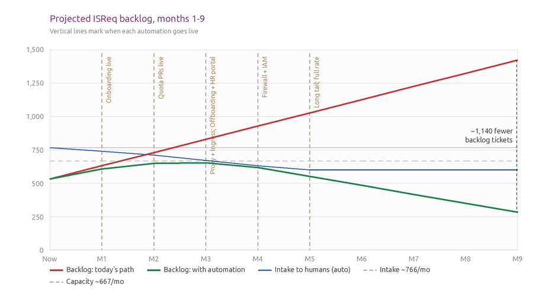

# IS Operations Automation

## Removing the lowest-value 42% of ISReq work from the human queue

Status: Proposal, open for review
Type: Process
Author: F. Carrillo, Site Reliability Engineer, Canonical IS
Scope: Canonical IS SRE, with the People team and the Launchpad team for the responsibilities this spec reassigns
Date: June 2026
Parent of:
Depends on:
Closes:

## Abstract

Three categories of work, pull request and merge proposal review, onboarding, and offboarding, account for 42% of ISReq ticket volume but only 22% of logged effort. This spec proposes automating that block, removing it from the human queue, recovering close to half an engineer of capacity, and using the recovered headroom to elevate the maturity of IS delivery toward consistent Elite DORA. It also reassigns the operating responsibilities this work touches, so IS stops being the single choke point for routine lifecycle changes at scale.

## Rationale

ISReq took in 3,016 tickets between 9 February and 17 June 2026 and logged 926 hours against them. Pull request and merge proposal review (985 tickets), onboarding (208), and offboarding (85) sum to 1,278 tickets, 42.4% of the total, for 201 logged hours, 21.7% of the total. This is the lowest-value work IS owns. We gain nothing by doing it by hand, and it is the work everyone notices when it slips: nobody thanks IS for an on-time offboarding, and a late one is immediately visible.

The deeper problem is that the lead time on this work is almost entirely queue, not effort. Decomposing each ticket into the time to triage, the idle time before pickup, and the active work logged by the engineer shows active work measured in minutes against a queue measured in days. An onboarding ticket is worked for about 15 minutes but waits a 95th percentile of 5.7 days just to leave the untriaged state. An offboarding ticket sits idle for a 95th percentile of 36 days, waiting on another team or a future termination date. The bottleneck is never the work. It is the human queue around it.

That queue is compounding. Intake runs at roughly 766 tickets per month against a sustained close rate of roughly 667, so the backlog grows by about 99 tickets every month. It went from 70 open tickets at the end of February to 532 by mid-June. We have no situational awareness of this forming in real time, because each month the gap is small and only the cumulative trend is alarming. Handling this volume by hand, running at scale as the organization grows, is not viable: the work scales with headcount and hiring more engineers to process a queue of three-minute approvals scales cost without addressing the flow.

There is also a maturity ceiling. A merged pull request is a change shipped, so review lead time is our DORA lead time for changes. The median is already Elite at a few hours, but the slowest fifth of changes waits from 15 hours to roughly 5 days, which drops those changes into the High band. Since the review itself is a three-minute check, every hour of that lead time is pure waiting. We cannot elevate the maturity of delivery to consistent Elite while a third of all changes sit in a human queue for days.

## Specification

### The conclusion: a backlog that stops compounding

Automating the shortlist removes roughly 166 tickets per month from the human queue. Today IS takes in roughly 766 tickets per month and closes roughly 667, so the backlog compounds by about 99 every month; removing 166 when we are only 99 over capacity flips that arithmetic. The backlog stops compounding and draws down: about 1,423 open tickets on today's path against about 283 with automation by month 9, roughly 1,140 fewer.

The vertical lines mark each automation go-live. The backlog rises briefly while the work is built, then draws down. The green line does not reach zero, and it is not meant to: IS will always receive routine work. After automation the residual sits under our closing capacity, so new work is absorbed within the month instead of accumulating. This is what lets IS operate at scale without the backlog compounding.

The rest of this section is the evidence behind that projection: where the work is, by area and sub-area; why it is safe to automate, because the lead time is queue rather than effort; the delivery-maturity case from DORA; the order to build it, by ROI; and the operating-model change and phased rollout that deliver it.

### The work by area

Ticket volume and logged time are concentrated. The full picture across ISReq, by area, sorted by logged time:

| Area | Tickets | Share of tickets | Logged hours | Share of time |
|---|---|---|---|---|
| IS Operated Services | 574 | 19.0% | 246 | 26.6% |
| ProdStack (private cloud) | 484 | 16.0% | 232 | 25.1% |
| Identity & Accounts | 439 | 14.6% | 160 | 17.3% |
| Other | 285 | 9.4% | 157 | 16.9% |
| Pull Request | 985 | 32.7% | 73 | 7.9% |
| SaaS | 180 | 6.0% | 34 | 3.7% |
| Public Cloud | 59 | 2.0% | 23 | 2.5% |
| Unknown | 10 | 0.3% | 0 | 0.1% |
| Total | 3,016 | 100% | 926 | 100% |

Pull request and merge proposal review is the single largest area by volume and the cheapest per ticket, which is exactly the profile of work to automate first.

### Full sub-area breakdown

Every sub-area, sorted by logged time. The three shortlisted categories, the PR/MP sub-areas, Onboarding, and Offboarding, are scattered through this list; the next subsection pulls them out.

| Area | Sub-area | Tickets | Share tix | Logged h | Share time |
|---|---|---|---|---|---|
| Other | - | 285 | 9.4% | 157 | 16.9% |
| IS Operated Services | Other | 166 | 5.5% | 77 | 8.3% |
| Identity & Accounts | Offboarding | 85 | 2.8% | 68 | 7.3% |
| Identity & Accounts | Onboarding | 208 | 6.9% | 60 | 6.5% |
| IS Operated Services | Database (DBaaS) | 77 | 2.6% | 51 | 5.5% |
| ProdStack (private cloud) | Other | 134 | 4.4% | 50 | 5.4% |
| ProdStack (private cloud) | Networking, Ingress | 96 | 3.2% | 48 | 5.2% |
| ProdStack (private cloud) | Compute, Instances | 89 | 3.0% | 39 | 4.2% |
| ProdStack (private cloud) | Storage, Object storage | 37 | 1.2% | 35 | 3.8% |
| Pull Request | Other | 329 | 10.9% | 27 | 2.9% |
| IS Operated Services | Ubuntu archive | 17 | 0.6% | 19 | 2.0% |
| Identity & Accounts | Canonical IdP | 73 | 2.4% | 18 | 1.9% |
| IS Operated Services | Bastion server | 112 | 3.7% | 17 | 1.9% |
| IS Operated Services | Kubernetes (K8saaS) | 34 | 1.1% | 17 | 1.8% |
| SaaS | GitHub | 88 | 2.9% | 16 | 1.7% |
| Pull Request | Proxy | 256 | 8.5% | 15 | 1.6% |
| ProdStack (private cloud) | Partner Cloud | 5 | 0.2% | 15 | 1.6% |
| ProdStack (private cloud) | Networking, Cloud-to-cloud connectivity | 22 | 0.7% | 15 | 1.6% |
| IS Operated Services | Juju, Model | 38 | 1.3% | 13 | 1.4% |
| Pull Request | Ingress | 141 | 4.7% | 13 | 1.4% |
| IS Operated Services | Juju, Controller | 15 | 0.5% | 12 | 1.3% |
| IS Operated Services | Juju, JAAS | 22 | 0.7% | 12 | 1.3% |
| ProdStack (private cloud) | Networking, Intra-cloud connectivity | 26 | 0.9% | 11 | 1.2% |
| Public Cloud | Azure | 22 | 0.7% | 11 | 1.1% |
| Identity & Accounts | Login Issues | 64 | 2.1% | 11 | 1.1% |
| IS Operated Services | Jenkins | 19 | 0.6% | 10 | 1.0% |
| ProdStack (private cloud) | Networking, Egress (proxy / firewall rules) | 40 | 1.3% | 9 | 0.9% |
| Pull Request | Firewall | 146 | 4.8% | 8 | 0.9% |
| SaaS | Google, Email | 12 | 0.4% | 7 | 0.8% |
| Public Cloud | AWS | 16 | 0.5% | 7 | 0.8% |
| ProdStack (private cloud) | Compute, Flavors | 12 | 0.4% | 6 | 0.7% |
| IS Operated Services | - | 4 | 0.1% | 6 | 0.6% |
| Pull Request | Quota | 56 | 1.9% | 5 | 0.5% |
| Public Cloud | GCP | 21 | 0.7% | 5 | 0.5% |
| Pull Request | IAM Groups | 47 | 1.6% | 4 | 0.5% |
| IS Operated Services | TLS certificates | 22 | 0.7% | 4 | 0.5% |
| SaaS | Google, Gemini | 52 | 1.7% | 4 | 0.4% |
| IS Operated Services | Content cache | 17 | 0.6% | 3 | 0.3% |
| ProdStack (private cloud) | Storage, Block storage | 12 | 0.4% | 3 | 0.3% |
| Identity & Accounts | GDPR | 6 | 0.2% | 3 | 0.3% |
| SaaS | - | 6 | 0.2% | 3 | 0.3% |
| IS Operated Services | Vault | 5 | 0.2% | 2 | 0.2% |
| IS Operated Services | DNS | 8 | 0.3% | 2 | 0.2% |
| IS Operated Services | Observability | 18 | 0.6% | 2 | 0.2% |
| SaaS | Google, Drive | 7 | 0.2% | 2 | 0.2% |
| ProdStack (private cloud) | Networking, Load Balancers | 5 | 0.2% | 2 | 0.2% |
| Identity & Accounts | - | 3 | 0.1% | 1 | 0.1% |
| Pull Request | Peer Network Model | 8 | 0.3% | 1 | 0.1% |
| SaaS | Google, Groups | 6 | 0.2% | 1 | 0.1% |
| SaaS | Site24x7 | 5 | 0.2% | 1 | 0.1% |
| ProdStack (private cloud) | Compute, Architectures | 5 | 0.2% | 1 | 0.1% |
| SaaS | Google, Calendar | 3 | 0.1% | 1 | 0.1% |
| Unknown | - | 10 | 0.3% | 0 | 0.1% |
| Pull Request | - | 2 | 0.1% | 0 | 0.0% |
| ProdStack (private cloud) | - | 1 | 0.0% | 0 | 0.0% |
| SaaS | Sentry | 1 | 0.0% | 0 | 0.0% |
| Total | | 3,016 | 100% | 926 | 100% |

### The automation shortlist

Pulling the three target categories out of the areas above gives the block this spec proposes to automate: 42% of tickets for 22% of logged time.

| Category | Tickets | Share of tickets | Logged hours | Share of time |
|---|---|---|---|---|
| PR/MP review (all sub-areas) | 985 | 32.7% | 73 | 7.9% |
| Onboarding | 208 | 6.9% | 60 | 6.5% |
| Offboarding | 85 | 2.8% | 68 | 7.3% |
| Automation shortlist total | 1,278 | 42.4% | 201 | 21.7% |
| Everything else | 1,738 | 57.6% | 725 | 78.3% |

The shortlist is high volume and low effort per item, with lead time dominated by queue rather than work. That combination is what makes it both worth automating and safe to automate: the decisions are mechanical and repetitive, and the cost of the current manual path is the waiting, not the judgement.

### Where the lead time goes

Each ticket's lead time splits into three spans: the triage queue (creation to first exit from the untriaged state), the active work logged by the engineer, and the pickup idle wait (everything else between triage and close). Read as 50th / 75th / 95th percentile, the active work is minutes while the queue is hours to days. Flow efficiency, the share of lead time that is actual work, is a few percent.

| Sub-area | Tickets | Logged h | Triage queue | Pickup idle | Active work |
|---|---|---|---|---|---|
| Offboarding | 85 | 68 | 4h / 19h / 3d | 0h / 14h / 36d | 30m / 50m / 1.9h |
| Onboarding | 208 | 60 | 6h / 8h / 6d | 0h / 0h / 47h | 15m / 20m / 55m |
| Other (PR) | 329 | 27 | 2h / 7h / 3d | 0h / 0h / 2d | 3m / 5m / 15m |
| Proxy | 256 | 15 | 2h / 10h / 3d | 0h / 0h / 6h | 3m / 3m / 8m |
| Ingress | 141 | 13 | 2h / 15h / 4d | 0h / 0h / 12h | 3m / 5m / 16m |
| Firewall | 146 | 8 | 2h / 7h / 3d | 0h / 0h / 0h | 3m / 4m / 10m |
| Quota | 56 | 5 | 2h / 8h / 4d | 0h / 0h / 46h | 3m / 5m / 17m |
| IAM Groups | 47 | 4 | 2h / 19h / 4d | 0h / 0h / 6d | 4m / 8m / 15m |

The bottleneck is never the work. It is the human queue around it, which is exactly what automation removes.

### Delivery maturity (DORA)

A merged pull request is a change shipped, so PR/MP lead time is our DORA lead time for changes, measured over 966 PR/MP tickets created to first close.

| DORA metric | Our level | Evidence | Elite band |
|---|---|---|---|
| Lead time for changes | Elite to High | p50 2.4h and p75 14.6h are Elite; p95 4.9d slips to High | under 1 day |
| Deployment frequency | Elite | about 57 PR/MP merged per week, effectively on-demand | on-demand |
| Change failure rate | Elite | about 95% merged unchanged, about 5% need rework | under 5% |
| Time to restore | not tracked | no MTTR signal in ISReq today | under 1 hour |

The median is already Elite, but the slowest fifth slips to High, and since the review itself is a three-minute check, that entire gap is queue. Auto-merging the safe majority moves the whole distribution inside Elite and lets us elevate the maturity of delivery to consistent Elite. The guardrail is to keep change failure under 5% by auto-merging only known-safe additive classes.

### PR/MP automation in ROI order

On every pull request (GitHub) or merge proposal (Launchpad), an engine reads the structural diff of the changed configuration and tests it against a versioned policy file the owning team controls. A known-safe, additive change that clears the guardrails is auto-merged and its ticket closed. Anything else is labelled for a human and routed to the owning team. GitHub is automatable today with a pull-request Action and a policy file. Launchpad has no Action equivalent and needs a hosted launchpadlib bot, which is more to build and operate.

Sub-areas are tackled in ROI order, with Quota first as the lowest-risk GitHub pilot that proves the pattern. ROI is the three-year return: hours recovered over one-time build, where recovered effort includes the context-switch cost of each interruption.

| Sub-area | System | Build (AI-assisted) | 3-year ROI | Auto-merge rate |
|---|---|---|---|---|
| Quota (pilot) | GitHub | about 5 days | 2.3x | 60% |
| Proxy | Launchpad | about 6 days | 7.9x | 55% |
| Ingress | GitHub and Launchpad | about 4 days | 6.7x | 55% |
| Firewall | Launchpad | about 4 days | 5.7x | 50% |
| Other | Both | about 6 days | 4.3x | 25% |
| IAM Groups | GitHub | about 3 days | 1.9x | 36% |

The owning teams keep control by editing the policy files. A one-line change raises a ceiling or adds a known-good destination. Reviewers stop rubber-stamping the safe majority and spend their attention on the cases that need judgement.

### The automation program

#### Onboarding

Automate the full joiner flow end to end in Temporal, with no manual step in the happy path. Account creation, group membership, mailbox provisioning, and access grants each become a Temporal activity with retries and an audit trail. This collapses the multi-day triage queue on a 15-minute task to minutes and removes onboarding from the human intake entirely except for genuine exceptions.

#### Offboarding

Automate the leaver flow in Temporal, mirroring onboarding: revoke access, archive, and reassign. Three operating changes go with it.

First, the People team triggers offboarding through a self-serve portal with authentication and full logging, rather than messaging IS directly at termination. The current path interrupts engineers and leaves no audit trail; a logged self-serve action fixes both. The offboarding idle wait, a 95th percentile of 36 days, is largely this hand-off.

Second, parts of the flow move to the teams that own the systems. Launchpad group membership moves to the Launchpad team, so IS is not the single point for every system in a leaver's profile.

Third, the People team adopts stricter and earlier offboarding practice. IS still receives requests it cannot satisfy, such as undoing erased Mattermost messages or moving files that no longer exist. Clear policy enforced at the source removes that rework.

#### Contractor lifecycle

Contractor management sits between onboarding and offboarding and costs the most per incident. When an extension is missed, access either lapses or lingers, and reconciling it is an emergency. Fold contractor start, extend, and end into the same Temporal flows, with a mandatory end-date and an automatic expiry reminder, so a missed extension can no longer create an incident.

### Operating model and RACI

The change is as much about who owns each activity as about the automation. Today IS is the default owner of every step. The target model pushes the trigger and the system-specific membership work to the teams that own those decisions, and keeps IS accountable for the automation and the exceptions. This is the operating model that lets IS run at scale.

| Activity set | IS SRE | People team | Launchpad team | Owning service teams |
|---|---|---|---|---|
| Build and operate the onboarding and offboarding Temporal flows | A, R | C | C | I |
| Trigger offboarding at termination, via the logged self-serve portal | C | A, R | I | I |
| Launchpad group membership changes during offboarding | C | I | A, R | I |
| Own the PR/MP auto-merge policy files (ceilings, allow-lists) | C | I | C | A, R |
| Build and operate the PR/MP auto-merge engine | A, R | I | C | C |
| Contractor end-date enforcement and extension tracking | C | A, R | I | C |
| Handle exceptions routed to a human | A, R | I | C | C |

R is responsible, A is accountable, C is consulted, I is informed.

### Implementation

Phases are anchored to milestones, not calendar dates. The months 1 to 9 axis on the chart is a planning projection of the rollout sequence, not a date commitment. Each phase is complete when its milestone is true.

#### Phase 1: Onboarding hands-free

The joiner happy path runs end to end in Temporal with zero manual steps. Complete when a run of consecutive joiners completes with no IS touch and a full audit trail. Owners: Alex and Loic.

#### Phase 2: Auto-merge engine proven on GitHub

The GitHub Action and the first policy file auto-merge Quota pull requests. Complete after a shadow period with no incorrect approvals, followed by live auto-merge with the owning team's sign-off on the policy file.

#### Phase 3: Offboarding hands-free and People-triggered

The offboarding Temporal flow is live, the People-facing self-serve portal with authentication and logging is in use, and Proxy and Ingress auto-merge are live. Complete when the People team triggers a real offboarding through the portal end to end and the two PR sub-areas auto-merge in production.

#### Phase 4: Coverage and handover

Firewall and IAM auto-merge are live on the same engine, and Launchpad group offboarding is handed to the Launchpad team with the launchpadlib bot operating. Complete when the Launchpad team owns its membership activity and the engine covers the four highest-ROI sub-areas.

#### Phase 5: Full rate and contractors

The long-tail PR classes are covered and the contractor lifecycle is folded into the Temporal flows with a mandatory end-date and expiry reminders. Complete when the auto-merge rate reaches steady state and no contractor expiry requires manual reconciliation.

### Open Issues

| Issue | Owner | Status |
|---|---|---|
| Classification. This is written as Process because it reassigns operating responsibilities and needs a RACI. It also carries Product Requirement and Implementation characteristics in the build detail; those belong in a child Implementation spec. Confirm the split. | F. Carrillo, J. Arregui | Open |
| Launchpad and Other auto-merge rates are projected from volume, not yet backtested. They drive the ROI ordering. A launchpadlib backtest is needed before the Launchpad sub-areas are committed. | IS SRE | Open |
| The model assumes a sustained close rate of about 667 per month and that capacity freed by automation is redeployed to the residual queue. If intake grows, the drawdown is slower, though still far below the do-nothing path. | IS SRE | Open |
| The operating-model change is only real if the People team agrees to own the offboarding trigger and contractor end-date enforcement. Process co-sign from Maksim is required. | F. Carrillo, Maksim | Open |
| Auto-merge guardrail. Each policy file needs the owning team's sign-off, and change-failure must stay under 5% before any class goes live. | Owning service teams | Open |
| Routing. J. Arregui must review before this reaches Pierre. Do not route directly to Pierre. | F. Carrillo | Open |

## Further Information

Method and data. All counts, logged hours, and percentiles are computed read-only against the ISReq analytics database by scripts/_verify_automation.py, over tickets created between 9 February and 17 June 2026. Flow spans are defined as: triage queue, creation to first exit from the untriaged state; active work, the sum of logged worklog; pickup idle, the close time minus triage minus active work, floored at zero. PR/MP is the Pull Request area. The supporting analysis is in operations-automation-analysis.pdf, and the chart is reproduced by scripts/make_backlog_chart.py.

Model assumptions. Intake of about 766 per month and a close rate of about 667 per month are the March to May averages. Auto-merge rates are backtested on GitHub pull requests and projected from volume for Launchpad and Other. Three-year ROI is three years of recovered effort over the one-time build, where recovered effort is logged handling plus a 15-minute context-switch per interruption. Build estimates are AI-assisted engineer-days. These are planning estimates, not commitments.

Alternatives considered. Do nothing: the backlog compounds and the visible slips continue. Hire to clear the queue: scales cost linearly, does not address queue-dominated flow, and does not elevate delivery maturity. Manual checklists or runbooks: still leaves IS as the single choke point, with no audit trail and no reduction in interruptions.

Related work. The ISReq analytics dashboard provides the underlying situational awareness. A child Implementation spec will carry the technical design for the Temporal flows, the GitHub Action, and the launchpadlib bot, and should be prioritized for James Simpson's technical co-sign.

## Spec History and Changelog

| Date | Attendees / Author | Change or Meeting Notes |
|---|---|---|
| 2026-06-18 | F. Carrillo | Initial draft. Scope set to the onboarding, offboarding, and PR/MP shortlist. Backlog impact model and RACI added. |
| 2026-06-18 | F. Carrillo | Added the by-area, flow-decomposition, DORA, and full sub-area tables. Reviewer before Pierre set to J. Arregui. |
| 2026-06-18 | F. Carrillo | Restructured the Specification to lead with the conclusion and the backlog chart, then drive to it with the evidence tables in analysis order: by-area, full sub-area, shortlist, flow, DORA, ROI. |
